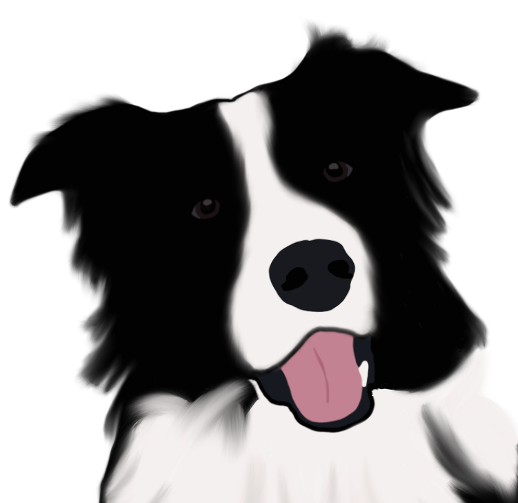

<h1> 
  
  Petraits
</h1>
Animal art for pet parents

  <a href="#features">Features</a> •
  <a href="#installation">Installation</a> •
  <a href="#contributing">Contributing</a>

#features

#installation
1. Clone this repository from your terminal

   `$ git clone https://github.com/kgolder92/petraits.git`

2. Install dependencies with `npm install`
3. Start with npm start
#contributing
